<!-- ============================================================
     Md Ridoan Mahmud Zisan — Professional Profile README
     Designed with precision. Built for impact.
     ============================================================ -->

<div align="center">

<!-- ===== HERO BANNER ===== -->
<picture>
  <source media="(prefers-color-scheme: dark)">
  
</picture>

<!-- ===== TYPING INTRO ===== -->
<a href="https://github.com/RidoanDev">
  
</a>

<!-- ===== METRICS ROW ===== -->
<div style="display: flex; justify-content: center; gap: 24px; flex-wrap: wrap; margin: 16px 0;">
  
  
  
  
</div>

</div>

<!-- ============================================================
     ABOUT ME — Clean, typographic presentation
     ============================================================ -->
<details>
<summary><h2 style="margin: 24px 0 12px 0;">👤 About Me</h2></summary>

```typescript
const developer = {
  name       : "Md Ridoan Mahmud Zisan",
  born       : "31 December 2007",
  location   : "Bogura, Bangladesh",
  role       : "Founder & Developer @ OnonnoBit",
  agency     : "ononnobit.vercel.app",
  email      : "ridoan.zisan@gmail.com",
  portfolio  : "ridoan-zisan.netlify.app",
  phone      : "+8801712525910",
  skills     : ["React", "TypeScript", "Tailwind CSS", "shadcn/ui", "Firebase", "REST APIs", "Git", "GitHub"],
  platforms  : ["Netlify", "Vercel"],
  builds     : ["Web Applications", "PWA Applications", "Websites"],
  mission    : "Crafting impactful digital solutions for real-world problems",
  originStory: "Started coding before 16 — and never stopped 🚀"
};
```

<div style="background: linear-gradient(135deg, #f0f9ff 0%, #e0f2fe 100%); border-left: 3px solid #3b82f6; padding: 16px 20px; border-radius: 0 8px 8px 0; margin: 16px 0;">

> 🏢 **Founder & Developer of [OnonnoBit](https://ononnobit.vercel.app)** — a custom web app development agency based in Bogura, Bangladesh. We build scalable React, TypeScript & Firebase applications — LMS platforms, e-commerce solutions, and business tools — for startups, SMBs, and NGOs.

</div>

</details>

<!-- ============================================================
     AGENCY — OnonnoBit
     ============================================================ -->
## 🏢 OnonnoBit — My Agency

<p>
  
</p>

<div style="display: grid; grid-template-columns: repeat(auto-fit, minmax(200px, 1fr)); gap: 16px; margin: 16px 0;">

  <div>
    <p style="font-weight: 700; color: #1e293b; margin: 0 0 4px 0;">What We Do</p>
    <ul style="margin: 0; padding-left: 20px; color: #475569; line-height: 1.6;">
      <li>Custom Web App Development</li>
      <li>LMS Solutions</li>
      <li>E-commerce Solutions</li>
      <li>Business Solutions</li>
      <li>SEO, AEO & GEO</li>
    </ul>
  </div>

  <div>
    <p style="font-weight: 700; color: #1e293b; margin: 0 0 4px 0;">Where We Are</p>
    <p style="margin: 0; color: #475569;">Bogura, Bangladesh<br><span style="color: #64748b;">Remote-first agency</span></p>
  </div>

  <div>
    <p style="font-weight: 700; color: #1e293b; margin: 0 0 4px 0;">Contact</p>
    <p style="margin: 0; color: #475569;">
      📧 ononnobit@gmail.com<br>
      📱 +8801763822211
    </p>
  </div>

</div>

<div style="display: flex; justify-content: center; gap: 12px; flex-wrap: wrap; margin: 20px 0;">
  <a href="https://ononnobit.vercel.app"></a>
  <a href="mailto:ononnobit@gmail.com"></a>
  <a href="https://wa.me/8801712525910"></a>
  <a href="https://github.com/ononnobit"></a>
  <a href="https://facebook.com/ononnobit"></a>
  <a href="https://instagram.com/ononnobit"></a>
  <a href="https://x.com/ononnobit"></a>
  <a href="https://linkedin.com/company/ononnobit"></a>
</div>

<!-- ============================================================
     TECH STACK — Elegant icon grid
     ============================================================ -->
## 🛠️ Tech Stack & Tools

<div style="display: flex; justify-content: center; flex-wrap: wrap; gap: 20px; margin: 20px 0;">

  <div style="text-align: center; padding: 16px 12px; background: #f8fafc; border-radius: 12px; border: 1px solid #e2e8f0; transition: all 0.2s ease;">
    
    <sub style="font-weight: 700; color: #1e293b;">React</sub>
  </div>

  <div style="text-align: center; padding: 16px 12px; background: #f8fafc; border-radius: 12px; border: 1px solid #e2e8f0;">
    
    <sub style="font-weight: 700; color: #1e293b;">TypeScript</sub>
  </div>

  <div style="text-align: center; padding: 16px 12px; background: #f8fafc; border-radius: 12px; border: 1px solid #e2e8f0;">
    
    <sub style="font-weight: 700; color: #1e293b;">Vite</sub>
  </div>

  <div style="text-align: center; padding: 16px 12px; background: #f8fafc; border-radius: 12px; border: 1px solid #e2e8f0;">
    
    <sub style="font-weight: 700; color: #1e293b;">Tailwind CSS</sub>
  </div>

  <div style="text-align: center; padding: 16px 12px; background: #f8fafc; border-radius: 12px; border: 1px solid #e2e8f0;">
    
    <sub style="font-weight: 700; color: #1e293b;">shadcn/ui</sub>
  </div>

  <div style="text-align: center; padding: 16px 12px; background: #f8fafc; border-radius: 12px; border: 1px solid #e2e8f0;">
    
    <sub style="font-weight: 700; color: #1e293b;">Firebase</sub>
  </div>

  <div style="text-align: center; padding: 16px 12px; background: #f8fafc; border-radius: 12px; border: 1px solid #e2e8f0;">
    
    <sub style="font-weight: 700; color: #1e293b;">Vercel</sub>
  </div>

  <div style="text-align: center; padding: 16px 12px; background: #f8fafc; border-radius: 12px; border: 1px solid #e2e8f0;">
    
    <sub style="font-weight: 700; color: #1e293b;">Netlify</sub>
  </div>

  <div style="text-align: center; padding: 16px 12px; background: #f8fafc; border-radius: 12px; border: 1px solid #e2e8f0;">
    
    <sub style="font-weight: 700; color: #1e293b;">Git</sub>
  </div>

  <div style="text-align: center; padding: 16px 12px; background: #f8fafc; border-radius: 12px; border: 1px solid #e2e8f0;">
    
    <sub style="font-weight: 700; color: #1e293b;">GitHub</sub>
  </div>

</div>

<!-- ============================================================
     GITHUB STATISTICS — Visual impact
     ============================================================ -->
## 📊 GitHub Statistics

<div style="display: grid; grid-template-columns: repeat(auto-fit, minmax(350px, 1fr)); gap: 20px; margin: 20px 0;">

  <div>
    <div style="background: linear-gradient(135deg, rgba(59,130,246,0.08), rgba(59,130,246,0.02)); border: 1px solid rgba(59,130,246,0.15); border-radius: 12px; padding: 16px; text-align: center;">
      
    </div>
  </div>

  <div style="display: flex; gap: 16px;">
    <div style="flex: 1; background: linear-gradient(135deg, rgba(59,130,246,0.08), rgba(59,130,246,0.02)); border: 1px solid rgba(59,130,246,0.15); border-radius: 12px; padding: 16px; text-align: center;">
      
    </div>
    <div style="flex: 1; background: linear-gradient(135deg, rgba(59,130,246,0.08), rgba(59,130,246,0.02)); border: 1px solid rgba(59,130,246,0.15); border-radius: 12px; padding: 16px; text-align: center;">
      
    </div>
  </div>

</div>

<!-- ============================================================
     LANGUAGES & ACTIVITY
     ============================================================ -->
## 💻 Most Used Languages

<div style="background: linear-gradient(135deg, rgba(59,130,246,0.08), rgba(59,130,246,0.02)); border: 1px solid rgba(59,130,246,0.15); border-radius: 12px; padding: 20px; margin: 16px 0;">
  
</div>

## 📈 Contribution Graph

<div style="display: flex; flex-direction: column; gap: 16px; margin: 16px 0;">
  <div style="background: linear-gradient(135deg, rgba(59,130,246,0.08), rgba(59,130,246,0.02)); border: 1px solid rgba(59,130,246,0.15); border-radius: 12px; padding: 20px;">
    
  </div>
  <div style="background: linear-gradient(135deg, rgba(59,130,246,0.08), rgba(59,130,246,0.02)); border: 1px solid rgba(59,130,246,0.15); border-radius: 12px; padding: 20px; text-align: center;">
    
  </div>
</div>

<!-- ============================================================
     GITHUB TROPHIES
     ============================================================ -->
## 🏆 GitHub Trophies

<div style="background: linear-gradient(135deg, rgba(59,130,246,0.08), rgba(59,130,246,0.02)); border: 1px solid rgba(59,130,246,0.15); border-radius: 12px; padding: 20px; margin: 16px 0;">
  
</div>

<!-- ============================================================
     FEATURED PROJECTS — Sophisticated cards
     ============================================================ -->
## 🚀 Featured Projects

<p style="color: #64748b; margin-bottom: 20px;">
  Selected highlights from 50+ projects built with modern web technologies.
</p>

<div style="display: flex; flex-direction: column; gap: 16px; margin: 16px 0;">

  <!-- Row 1 -->
  <div style="display: grid; grid-template-columns: repeat(auto-fit, minmax(320px, 1fr)); gap: 16px;">

    <div style="background: #ffffff; border: 1px solid #e2e8f0; border-radius: 12px; padding: 20px; box-shadow: 0 4px 6px -1px rgba(0,0,0,0.05); transition: transform 0.2s, box-shadow 0.2s;">
      <h3 style="margin: 0 0 8px 0; color: #0f172a; display: flex; align-items: center; gap: 8px;">
        <span style="font-size: 1.4rem;">🛒</span> BitQraft
      </h3>
      <p style="color: #64748b; margin: 0 0 12px 0; line-height: 1.5;">
        Full-featured e-commerce platform with product listings, cart, and checkout system.
      </p>
      <div style="display: flex; gap: 8px; flex-wrap: wrap;">
        
        
        
      </div>
      <a href="https://bitqraft.netlify.app" style="display: inline-block; margin-top: 12px; color: #3b82f6; text-decoration: none; font-weight: 600;">View Project →</a>
    </div>

    <div style="background: #ffffff; border: 1px solid #e2e8f0; border-radius: 12px; padding: 20px; box-shadow: 0 4px 6px -1px rgba(0,0,0,0.05); transition: transform 0.2s, box-shadow 0.2s;">
      <h3 style="margin: 0 0 8px 0; color: #0f172a; display: flex; align-items: center; gap: 8px;">
        <span style="font-size: 1.4rem;">🚨</span> Chor Koi
      </h3>
      <p style="color: #64748b; margin: 0 0 12px 0; line-height: 1.5;">
        Corruption alert platform empowering citizens to report and track corruption cases.
      </p>
      <div style="display: flex; gap: 8px; flex-wrap: wrap;">
        
        
        
      </div>
      <a href="https://chor-koi.vercel.app" style="display: inline-block; margin-top: 12px; color: #3b82f6; text-decoration: none; font-weight: 600;">View Project →</a>
    </div>

  </div>

  <!-- Row 2 -->
  <div style="display: grid; grid-template-columns: repeat(auto-fit, minmax(320px, 1fr)); gap: 16px;">

    <div style="background: #ffffff; border: 1px solid #e2e8f0; border-radius: 12px; padding: 20px; box-shadow: 0 4px 6px -1px rgba(0,0,0,0.05);">
      <h3 style="margin: 0 0 8px 0; color: #0f172a; display: flex; align-items: center; gap: 8px;">
        <span style="font-size: 1.4rem;">🎓</span> UpCoach
      </h3>
      <p style="color: #64748b; margin: 0 0 12px 0; line-height: 1.5;">
        EdTech platform providing quality educational resources and learning tools.
      </p>
      <div style="display: flex; gap: 8px; flex-wrap: wrap;">
        
        
        
      </div>
      <a href="https://upcoach.netlify.app" style="display: inline-block; margin-top: 12px; color: #3b82f6; text-decoration: none; font-weight: 600;">View Project →</a>
    </div>

    <div style="background: #ffffff; border: 1px solid #e2e8f0; border-radius: 12px; padding: 20px; box-shadow: 0 4px 6px -1px rgba(0,0,0,0.05);">
      <h3 style="margin: 0 0 8px 0; color: #0f172a; display: flex; align-items: center; gap: 8px;">
        <span style="font-size: 1.4rem;">🩸</span> BloodMate
      </h3>
      <p style="color: #64748b; margin: 0 0 12px 0; line-height: 1.5;">
        Blood management system connecting donors and recipients efficiently.
      </p>
      <div style="display: flex; gap: 8px; flex-wrap: wrap;">
        
        
        
      </div>
      <a href="https://blood-mate.netlify.app" style="display: inline-block; margin-top: 12px; color: #3b82f6; text-decoration: none; font-weight: 600;">View Project →</a>
    </div>

  </div>

  <!-- Row 3 -->
  <div style="display: grid; grid-template-columns: repeat(auto-fit, minmax(320px, 1fr)); gap: 16px;">

    <div style="background: #ffffff; border: 1px solid #e2e8f0; border-radius: 12px; padding: 20px; box-shadow: 0 4px 6px -1px rgba(0,0,0,0.05);">
      <h3 style="margin: 0 0 8px 0; color: #0f172a; display: flex; align-items: center; gap: 8px;">
        <span style="font-size: 1.4rem;">📱</span> ZiptoGram
      </h3>
      <p style="color: #64748b; margin: 0 0 12px 0; line-height: 1.5;">
        Mini social media platform for sharing posts and connecting with people.
      </p>
      <div style="display: flex; gap: 8px; flex-wrap: wrap;">
        
        
        
      </div>
      <a href="https://micro-media.netlify.app" style="display: inline-block; margin-top: 12px; color: #3b82f6; text-decoration: none; font-weight: 600;">View Project →</a>
    </div>

    <div style="background: #ffffff; border: 1px solid #e2e8f0; border-radius: 12px; padding: 20px; box-shadow: 0 4px 6px -1px rgba(0,0,0,0.05);">
      <h3 style="margin: 0 0 8px 0; color: #0f172a; display: flex; align-items: center; gap: 8px;">
        <span style="font-size: 1.4rem;">📦</span> Zisan Traders
      </h3>
      <p style="color: #64748b; margin: 0 0 12px 0; line-height: 1.5;">
        Inventory management system for tracking stock, sales, and business operations.
      </p>
      <div style="display: flex; gap: 8px; flex-wrap: wrap;">
        
        
        
      </div>
      <a href="https://zisan-trader.netlify.app" style="display: inline-block; margin-top: 12px; color: #3b82f6; text-decoration: none; font-weight: 600;">View Project →</a>
    </div>

  </div>

  <!-- Row 4 -->
  <div style="display: grid; grid-template-columns: repeat(auto-fit, minmax(320px, 1fr)); gap: 16px;">

    <div style="background: #ffffff; border: 1px solid #e2e8f0; border-radius: 12px; padding: 20px; box-shadow: 0 4px 6px -1px rgba(0,0,0,0.05);">
      <h3 style="margin: 0 0 8px 0; color: #0f172a; display: flex; align-items: center; gap: 8px;">
        <span style="font-size: 1.4rem;">🏆</span> Tournamention
      </h3>
      <p style="color: #64748b; margin: 0 0 12px 0; line-height: 1.5;">
        Tournament management system for organizing brackets, teams, and scores.
      </p>
      <div style="display: flex; gap: 8px; flex-wrap: wrap;">
        
        
        
      </div>
      <a href="https://tournamention.netlify.app" style="display: inline-block; margin-top: 12px; color: #3b82f6; text-decoration: none; font-weight: 600;">View Project →</a>
    </div>

    <div style="background: #ffffff; border: 1px solid #e2e8f0; border-radius: 12px; padding: 20px; box-shadow: 0 4px 6px -1px rgba(0,0,0,0.05);">
      <h3 style="margin: 0 0 8px 0; color: #0f172a; display: flex; align-items: center; gap: 8px;">
        <span style="font-size: 1.4rem;">🌱</span> YouthHopeBD
      </h3>
      <p style="color: #64748b; margin: 0 0 12px 0; line-height: 1.5;">
        Youth organization platform promoting community engagement and social impact.
      </p>
      <div style="display: flex; gap: 8px; flex-wrap: wrap;">
        
        
        
      </div>
      <a href="https://youthhope-bd.netlify.app" style="display: inline-block; margin-top: 12px; color: #3b82f6; text-decoration: none; font-weight: 600;">View Project →</a>
    </div>

  </div>

</div>

<div style="display: flex; justify-content: center; gap: 16px; margin: 24px 0;">
  <a href="https://ononnobit.vercel.app">
    
  </a>
  <a href="https://ridoan-zisan.netlify.app/blog">
    
  </a>
</div>

<!-- ============================================================
     CERTIFICATIONS — Clean grid with hover effects
     ============================================================ -->
## 🎓 Certifications

### 💻 Technology & Development

<div style="display: grid; grid-template-columns: repeat(auto-fit, minmax(200px, 1fr)); gap: 16px; margin: 16px 0;">

  <div>
    <a href="https://i.postimg.cc/SRk6P0YS/Google-IT-Support.png">
      
      <p style="text-align: center; font-weight: 600; margin: 8px 0 0 0; color: #1e293b;">Google IT Support</p>
    </a>
  </div>

  <div>
    <a href="https://i.postimg.cc/nhk0pcgv/Foundations-of-Cyber-Security.png">
      
      <p style="text-align: center; font-weight: 600; margin: 8px 0 0 0; color: #1e293b;">Foundations of Cyber Security</p>
    </a>
  </div>

  <div>
    <a href="https://i.postimg.cc/gkr6Ym10/Complete-Web-Development.png">
      
      <p style="text-align: center; font-weight: 600; margin: 8px 0 0 0; color: #1e293b;">Complete Web Development</p>
    </a>
  </div>

  <div>
    <a href="https://i.postimg.cc/L6qhcvZY/Introduction-to-Python.jpg">
      
      <p style="text-align: center; font-weight: 600; margin: 8px 0 0 0; color: #1e293b;">Introduction to Python</p>
    </a>
  </div>

  <div>
    <a href="https://i.postimg.cc/j2X7CZSv/Python-for-Data-Science-AI-Development.png">
      
      <p style="text-align: center; font-weight: 600; margin: 8px 0 0 0; color: #1e293b;">Python for Data Science & AI</p>
    </a>
  </div>

  <div>
    <a href="https://i.postimg.cc/fTWdVzN6/introduction-to-artificial-intelligence.png">
      
      <p style="text-align: center; font-weight: 600; margin: 8px 0 0 0; color: #1e293b;">Introduction to AI</p>
    </a>
  </div>

  <div>
    <a href="https://i.postimg.cc/7YB27FPb/machine-learning.png">
      
      <p style="text-align: center; font-weight: 600; margin: 8px 0 0 0; color: #1e293b;">Machine Learning</p>
    </a>
  </div>

  <div>
    <a href="https://i.postimg.cc/XvKr2JBs/digital-marketing.png">
      
      <p style="text-align: center; font-weight: 600; margin: 8px 0 0 0; color: #1e293b;">Digital Marketing</p>
    </a>
  </div>

</div>

### 🌍 Sustainability & Climate

<div style="display: grid; grid-template-columns: repeat(auto-fit, minmax(200px, 1fr)); gap: 16px; margin: 16px 0;">

  <div>
    <a href="https://i.postimg.cc/V6Dd8VRM/Gender-equality-and-human-rights-in-climate-action-and-renewable-energy.jpg">
      
      <p style="text-align: center; font-weight: 600; margin: 8px 0 0 0; color: #1e293b;">Gender & Climate Action</p>
    </a>
  </div>

  <div>
    <a href="https://i.postimg.cc/ZR7Kgybx/Net-Zero-101-What-Why-and-How.jpg">
      
      <p style="text-align: center; font-weight: 600; margin: 8px 0 0 0; color: #1e293b;">Net Zero 101</p>
    </a>
  </div>

  <div>
    <a href="https://i.postimg.cc/tCL7pPhr/Introduction-to-Sustainable-Development-in-Practice.jpg">
      
      <p style="text-align: center; font-weight: 600; margin: 8px 0 0 0; color: #1e293b;">Sustainable Development</p>
    </a>
  </div>

  <div>
    <a href="https://i.postimg.cc/zv4DDZRL/The-UN-Climate-Change-process.jpg">
      
      <p style="text-align: center; font-weight: 600; margin: 8px 0 0 0; color: #1e293b;">UN Climate Change Process</p>
    </a>
  </div>

</div>

### 🏅 Competitions & Leadership

<div style="display: grid; grid-template-columns: repeat(auto-fit, minmax(200px, 1fr)); gap: 16px; margin: 16px 0;">

  <div>
    <a href="https://i.postimg.cc/8CfQNkjN/BOBDO.png">
      
      <p style="text-align: center; font-weight: 600; margin: 8px 0 0 0; color: #1e293b;">BOBDO App Developer</p>
    </a>
  </div>

  <div>
    <a href="https://i.postimg.cc/pLFhFkWb/Bangladesh-Mathematical-Olympiad.png">
      
      <p style="text-align: center; font-weight: 600; margin: 8px 0 0 0; color: #1e293b;">Bangladesh Math Olympiad</p>
    </a>
  </div>

  <div>
    <a href="https://i.postimg.cc/wMwnXdDM/ICT-Olympiad.png">
      
      <p style="text-align: center; font-weight: 600; margin: 8px 0 0 0; color: #1e293b;">ICT Olympiad</p>
    </a>
  </div>

  <div>
    <a href="https://i.postimg.cc/tTg8j6x0/GK-olympiad.jpg">
      
      <p style="text-align: center; font-weight: 600; margin: 8px 0 0 0; color: #1e293b;">GK Olympiad</p>
    </a>
  </div>

</div>

<div style="text-align: center; margin: 20px 0;">
  <a href="https://ridoan-zisan.netlify.app/#certificates">
    
  </a>
</div>

<!-- ============================================================
     CONNECT
     ============================================================ -->
## 🤝 Connect With Me

<div style="display: flex; justify-content: center; gap: 12px; flex-wrap: wrap; margin: 20px 0;">

  <a href="https://ononnobit.vercel.app"></a>
  <a href="mailto:ononnobit@gmail.com"></a>
  <a href="https://ridoan-zisan.netlify.app"></a>
  <a href="https://github.com/RidoanDev"></a>
  <a href="https://linkedin.com/in/ridoan-zisan"></a>
  <a href="https://facebook.com/ridoan.zisan"></a>
  <a href="tel:+8801712525910"></a>

</div>

<!-- ============================================================
     FOOTER
     ============================================================ -->
<div align="center">

<picture>
  <source media="(prefers-color-scheme: dark)">
  
</picture>

<div style="margin-top: 24px; padding: 16px; background: linear-gradient(135deg, #f0f9ff, #e0f2fe); border-radius: 12px; display: inline-block;">

> ⭐ <i>If you find my work interesting, consider giving my repos a star — it truly means a lot!</i> ⭐

</div>

<p style="margin-top: 16px; color: #94a3b8; font-size: 0.9em;">
  Built with ☕ and code · © 2024 Md Ridoan Mahmud Zisan
</p>

</div>
